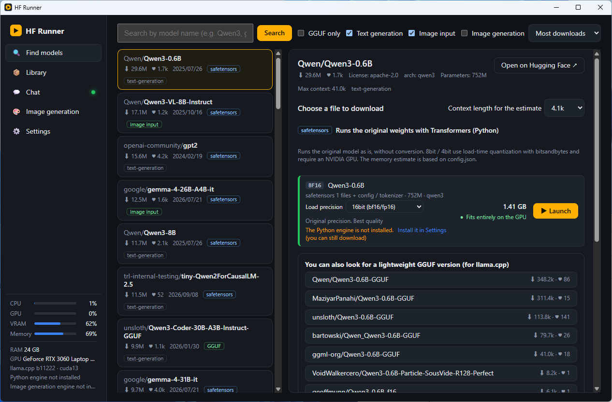
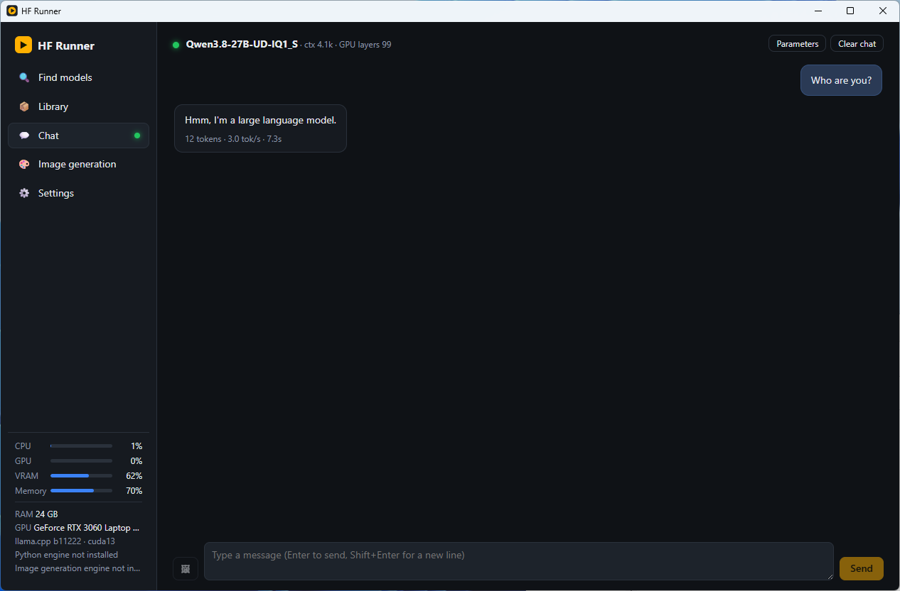

# HF Runner

English | [日本語](README.ja.md)

**Find models on Hugging Face, download them, and run them on your own PC** — a desktop app for Windows.

No command line or Python knowledge needed. When you search for a model, HF Runner shows in color whether it will run with this PC's memory, and one button takes you from download to chat or image generation. Everything runs locally; what you type is never sent anywhere.

- 💬 **Chat** — talk to text-generation models such as Qwen, Gemma and Llama
- 🖼️ **Ask about images** — paste an image into a vision-language model and ask about it
- 🎨 **Image generation** — create images with Stable Diffusion / SDXL / FLUX.1 / Qwen-Image (prompts written in other languages can be translated into English automatically)

> The UI is available in English and Japanese (chosen automatically from the OS language; change it in Settings → Language). HF Runner is an unofficial, independently developed app and is not affiliated with Hugging Face.

| Find models | Chat |
| --- | --- |
|  |  |

## Features

- **Know whether it runs before downloading** — for every file in a repository (Q4_K_M, Q8_0, …) HF Runner shows whether it fits this PC's RAM / VRAM: "fits entirely on the GPU", "partly on the GPU", "runs on the CPU" or "likely not enough memory". It reads only the start of each file to decide
- **Engines are set up for you** — the inference engines ([llama.cpp](https://github.com/ggml-org/llama.cpp) / [stable-diffusion.cpp](https://github.com/leejet/stable-diffusion.cpp) / Python + Transformers) are downloaded from their official releases when needed. Choose Vulkan, CUDA or CPU to match your GPU
- **Fast, resumable downloads** — large files are downloaded over several connections in parallel and resume where they stopped
- **Image-generation components included** — for models distributed as the core model only (FLUX.1, Qwen-Image, …), the required VAE and text encoders are downloaded automatically
- **Tells you up front when a file can't run** — files that won't work as they are (speculative-decoding drafts, custom quantizations, …) show the reason, and downloading / launching is blocked
- **Portable** — the zip version keeps the app, engines and models in a single folder. Move it to another location or a USB drive and it still works
- **Use it from other apps** — the loaded model is also available as an OpenAI-compatible API (`http://127.0.0.1:18080/v1`). If port 18080 is taken by another app, the next free port (18081, …) is used; the actual port is shown in the Library's running-model panel (the default port can be changed in Settings)
- **Server mode** — let other PCs, phones and apps on the same network use the loaded model, protected by an API key. Keep HF Runner in the system tray and it keeps running after you close the window

## Requirements

| | Minimum | Recommended |
| --- | --- | --- |
| OS | Windows 10 / 11 (64-bit) | Windows 11 |
| Memory | 8 GB | 16 GB or more |
| GPU | Not required (runs on the CPU) | NVIDIA / AMD / Intel GPU (6 GB VRAM or more) |
| Disk | About 1–20 GB per model | SSD |

Memory decides how large a model you can run. As a rule of thumb, 16 GB of RAM runs a 7–8B model at Q4_K_M (about 5 GB) comfortably. Image generation is much faster with a GPU (on the CPU one image takes several minutes).

## Installation

Download one of the following from [Releases](../../releases). Changes in each version are listed in [CHANGELOG.md](CHANGELOG.md).

| File | How to use |
| --- | --- |
| `HF-Runner-<version>-win-x64.exe` | **Installer.** Run it to install; HF Runner is added to the Start menu |
| `HF-Runner-<version>-win-x64.zip` | **No installation.** Extract it anywhere and run `HF Runner.exe` |

Extract the zip version to a **short path such as `C:\Tools\HF Runner\`**. In a deep folder the Python engine installation can hit Windows' path-length limit.

### First launch

- **"Windows protected your PC"** — the app is not code-signed, so SmartScreen shows a warning. Click "More info" → "Run anyway"
- **The very first launch can take 5–10 seconds** — Windows 11 Smart App Control inspects a new app the first time it runs. A splash screen is shown meanwhile. Later launches start immediately

## Usage

### 1. Install an inference engine

On first launch, pick an engine in the banner at the top and click "Install" (you can add the others later in Settings).

| Engine | Models | Notes |
| --- | --- | --- |
| **llama.cpp** (recommended) | GGUF | Light and fast. Start here |
| Python / Transformers | safetensors (original, unconverted models) | Sets up a Python environment of a few GB automatically |
| stable-diffusion.cpp | Image-generation models | For "Image generation" |

llama.cpp and stable-diffusion.cpp let you choose the GPU backend.

| Option | For |
| --- | --- |
| **Vulkan** (recommended) | Any NVIDIA / AMD / Intel GPU. Nothing else to install |
| CUDA 12 / 13 | Fastest on NVIDIA GPUs |
| CPU | No GPU, or when the GPU build doesn't work |

### 2. Find and download a model

Search by name in "Find models" (e.g. `Qwen3`, `gemma`, `Llama-3.1`). Use the checkboxes to filter by "Text generation", "Image input" and "Image generation".

Select a model to see each file with its size and a color showing whether it will run. **When in doubt, Q4_K_M** is a good balance of size and quality. Pick a green (fits on the GPU) or light-green (partly on the GPU) file and click "Download".

- For a model without GGUF files, HF Runner looks for GGUF versions of the same model
- Gated models (that require accepting terms) can be downloaded after you enter a Hugging Face access token in Settings

### 3. Launch and chat

Click "▶ Launch" in the Library to load the model and switch to Chat. A progress bar shows the loading progress.

- For models that output their reasoning (`<think>`), the reasoning is shown folded
- With vision models you can attach images by pasting, dropping, or the attach button
- When you're done, click "⏏ Unload" to free the memory
- Each engine's launch command can be edited under "Launch command" in Settings (e.g. add `-ctk q8_0 -ctv q8_0` to llama.cpp, or change `-c {ctx}` to `-c 8192`). Placeholders such as `{model}` and `{port}` are replaced with the model path, port, etc. on each launch. "Restore default" reverts it at any time

### 4. Image generation

Install stable-diffusion.cpp, then search with "Image generation" checked (e.g. `stable-diffusion-v1-5`, `FLUX.1-schnell`). After downloading, launch the model on the "Image generation" page, enter a prompt and click "Generate".

- Components such as FLUX.1's VAE and text encoders are downloaded together with the model and shared between models
- Generated images are saved with their parameters; "Use these settings" reuses them
- **Prompts in other languages work too** — turn on "Translate prompts into English" to download a multilingual model (requires llama.cpp) that translates prompts in Japanese, Chinese, Korean, French and other languages into English each time you generate. Choose the translation model next to the checkbox: **Qwen3-4B-Instruct-2507** (recommended, about 2.3 GB, accurate in many languages) or **Qwen3-1.7B** (lightweight, about 1.0 GB, faster and uses less memory, but makes mistakes in German, Spanish, etc.). Text written only with English letters (e.g. French without accents) is treated as English and not translated automatically; use "Preview translation" to translate and replace it

### 5. Use it from other PCs and apps (server mode)

In "Settings → Server mode", turn on server mode to see:

- **URL** — e.g. `http://192.168.1.10:18000/v1` (fixed port; can be changed in Settings)
- **API key** — created automatically when you enable server mode; "Regenerate" replaces it

Any OpenAI-compatible app or SDK works: set the base URL to this URL and the API key to this key.

```python
from openai import OpenAI
client = OpenAI(base_url="http://192.168.1.10:18000/v1", api_key="hfr-...")
print(client.chat.completions.create(model="local", messages=[{"role": "user", "content": "Hello"}]).choices[0].message.content)
```

- Requests go to whichever model is loaded in HF Runner. Switching models doesn't change the URL or key (with no model loaded, the API returns 503)
- If Windows Firewall asks the first time, allow "Private networks". **Don't enable server mode on public networks such as café Wi-Fi**
- With "Keep running in the system tray" on, closing the window doesn't quit the app. To quit, right-click the tray icon and choose "Quit"

## Supported models

| Type | Format | Engine |
| --- | --- | --- |
| Text generation | GGUF | llama.cpp |
| Text generation | safetensors (with `config.json`) | Python / Transformers |
| Image input (vision-language models) | GGUF + mmproj / safetensors | llama.cpp / Transformers |
| Image generation | Stable Diffusion 1.x / 2.x / SDXL (single-file), FLUX.1, SD3.5, Qwen-Image / Qwen-Image 2.1 (GGUF / safetensors) | stable-diffusion.cpp |

`.gguf` files you already have also appear in the Library when you put them in the models folder.

### Not supported

- **Draft models** for speculative decoding (`-draft-` files that contain only part of a model)
- **Custom quantizations** not in official llama.cpp (e.g. PrismML Ternary Bonsai `PTQ1_0` / `PQ2_0`)
- Image-generation models in formats stable-diffusion.cpp can't read (Apple MLX, NVFP4, …)
- Diffusers-format image-generation models (`model_index.json` + subfolders), LoRA, image editing (img2img)
- Audio, video, and repositories with only `pytorch_model.bin`

These show the reason in search results and the Library, and cannot be downloaded or launched.

## Where data is stored

| What | Installer version | Zip version |
| --- | --- | --- |
| Models | `Documents\HFRunner\models\` (changeable in Settings) | `<folder>\data\models\` |
| Engines, settings, generated images | `%APPDATA%\HF Runner\` | `<folder>\data\` |

Models are stored under `<author>\<repository>\`. Delete models you no longer need with 🗑 in the Library.

## Troubleshooting

| Problem | What to do |
| --- | --- |
| Loading stops with an out-of-memory error | Choose a smaller quantization (Q4_K_M → Q3_K_M / IQ3_XXS, …) or reduce "GPU layers" in Settings |
| "The inference server exited" | The error area explains the cause. See "Show server log" for details |
| A new model won't load (unknown model architecture) | Update llama.cpp in Settings |
| The GPU build doesn't work | Switch the engine to the CPU build in Settings |
| It runs on the wrong GPU (e.g. the integrated one) | Choose the GPU under "GPU to use" in Settings (by default a discrete GPU is preferred) |
| Image generation is very slow | It's running on the CPU. Reinstall stable-diffusion.cpp as the Vulkan / CUDA build |
| The Python engine fails to install (zip version) | Move the folder to a short path such as `C:\Tools\HF Runner\` |

## Notes

- **Each model has its own license.** Check the license and terms on the model's page before use. This app does not distribute models; engines and models are downloaded from GitHub / Hugging Face at run time
- The loaded model's API (`127.0.0.1`) is reachable only from this PC. Other devices can use it only when server mode is on (API key required)

### Licenses of automatically downloaded models

The following are downloaded automatically as image-generation components or for prompt translation. **Components with commercial-use restrictions** are marked with ⚠ before download and in the components line.

| Purpose | Source | License |
| --- | --- | --- |
| FLUX.1 VAE / CLIP-L / T5-XXL | `second-state/FLUX.1-schnell-GGUF`, `comfyanonymous/flux_text_encoders`, `city96/t5-v1_1-xxl-encoder-gguf` | Apache-2.0 |
| Qwen-Image VAE / text encoder | `QuantStack/Qwen-Image-GGUF`, `mradermacher/Qwen2.5-VL-7B-Instruct-GGUF` (original model is Apache-2.0) | Apache-2.0 |
| Qwen-Image 2.1 text encoder | `Qwen/Qwen3-VL-8B-Instruct-GGUF` | Apache-2.0 |
| **Qwen-Image 2.1 VAE, PE text encoders** | `Comfy-Org/Qwen-Image-2.1` | **[Qwen Research License](https://huggingface.co/Qwen/Qwen-Image-2.1/blob/main/LICENSE) — non-commercial use only (research and evaluation)** |
| **SD3.5 CLIP-G** | `Comfy-Org/stable-diffusion-3.5-fp8` | **[Stability AI Community License](https://huggingface.co/stabilityai/stable-diffusion-3.5-large/blob/main/LICENSE.md) — commercial use requires registration; a separate agreement above USD 1M annual revenue** |
| Prompt translation | `unsloth/Qwen3-4B-Instruct-2507-GGUF`, `unsloth/Qwen3-1.7B-GGUF` (only the one you choose is downloaded) | Apache-2.0 |

License information is as of September 2026. Check each repository for the current terms.

## For developers

See [docs/DEVELOPMENT.md](docs/DEVELOPMENT.md) (Japanese) for building, architecture and internals.

## License

[MIT License](LICENSE) — Copyright (c) 2026 HF Runner

The distribution includes the following software; their license texts are bundled (`LICENSE.electron.txt`, `LICENSES.chromium.html`, each `LICENSE` inside `app\resources\app.asar`, and the copyright notices at the end of the UI's JS bundle).

| Software | License |
| --- | --- |
| [Electron](https://www.electronjs.org/) / Chromium | MIT / various (`LICENSES.chromium.html`) |
| [React](https://react.dev/) (react, react-dom, scheduler) | MIT |
| [extract-zip](https://github.com/max-mapper/extract-zip) and its dependencies (yauzl, debug, …) | BSD-2-Clause / MIT / ISC |

The following are downloaded by the user's PC from their official sources at run time (not included in the app).

| Software | License |
| --- | --- |
| [llama.cpp](https://github.com/ggml-org/llama.cpp) | MIT |
| [stable-diffusion.cpp](https://github.com/leejet/stable-diffusion.cpp) | MIT |
| [uv](https://github.com/astral-sh/uv) | MIT / Apache-2.0 |
| [PyTorch](https://pytorch.org/) / torchvision | BSD-3-Clause |
| [Transformers](https://github.com/huggingface/transformers), accelerate, safetensors, sentencepiece | Apache-2.0 |
| bitsandbytes, tiktoken | MIT |
| Pillow | MIT-CMU (HPND) |
| protobuf | BSD-3-Clause |
